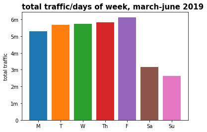
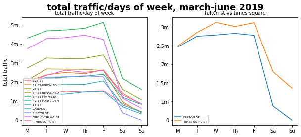

# Maximizing Advertising Reach Using MTA Data 
Caroline Shi

## Abstract
The purpose of this project was to use Exploratory Data Analysis on MTA data to determine how best to advertise a soon-to-be released bottled matcha beverage in New York, particularly focusing on what stations to advertise as per total traffic and what days and time would be best to maximize product exposure. After cleaning and analyzing the data, I was able to draw insights and visualize the traffic patterns of MTA riders that would best serve my objective. 

## Design
New York-based matcha company, Cha Cha Matcha, is coming out with a new bottled beverage with distribution limited to New York City and they want to roll out a series of digital advertisements throughout subways stations. With a limited budget, they can't advertise at every subway station in New York. They would like to know at which stations and at what times should they advertise to best maximize their product exposure. 

## Data
I chose to analyze a four month period spanning from March to June 2019. I opted to analyze data from 2019 instead of 2020 due to Covid-19 as I wanted to analyze a more normal traffic pattern. I chose a timespan that would tenatively cover two seasons to see if there was a significant impact on ridership numbers. 

## Algorithms
* _Importing Data_
	* Used SQLite to create a database and table to upload my raw data into
	* DB Browser allowed me to visualize my database and start thinking about how I wanted to organize and clean my data, see what columns would be important to extract data from

* _Cleaning Data_
	* Extracted my data into Python using SQLAlchemy to create a DataFrame I could clean and manipulate
	* Looked for duplicates, missing values, formatting issues
	* My biggest issue was the inconsistent entry and exit counter per turnstile as most of my calculations hinged on being able to calculate the traffic per station. Some turnstiles would start counting in reverse while other turnstiles would suddenly reset their counter to a completely different number. I was able to write a function that looped through and addressed these issues. 

* _Analyzing Data_
	* Once I was able to calculate the number of entries and exits per turnstile in each station, analyzing data was a process of grouping data into relevant categories that allowed me to see when and where advertisements should be placed. From here on, I started looking at total traffic (entries + exits) for the top 10 busiest stations to limit my scope of advertising to stations with the most foot traffic. 
	* I primarily organized data in two ways: by time and by day of the week. 
		* _By Time:_ Entries and exits were updated in four hour time intervals but not on a consistent schedule; some would be updated at midnight, 4 A.M.  and so forth while others would be updated at 11 P.M., 3 A.M., etc. While not perfect, I grouped total traffic into four hour intervals that I thought would be best for visualization and practicality. 
		* _By Day of Week:_ I totalled up and grouped traffic by days of the week to see if there was a significant weekend ridership drop off for any of the ten stations I was analyzing. 

## Tools
* DB Browser and SQLite for data ingestion and storage
* SQLAlchemy for database and Python communication
* Numpy and Pandas for data cleaning and manipulation
* Matplotlib and Seaborn for plotting and visualization

## Communication
_Insights:_
	* Weekdays during morning and night commuting hours had the most traffic.
	* There were some notable exceptions to this case:
		* Stations near Wall Street had a significant weekend ridership drop off. Maybe it would still be smart to advertise there on the weekends with professionals still trafficking those stations to work on the weekends. 
		* Times Square did not see a big weekend drop off, perhaps due to the influx of tourists on the weekend. Here, it would make sense to pull advertising on the weekends due to the limited distribution of our product to New York City and the irrelevancy of the product to those coming from out-of-town. 

 