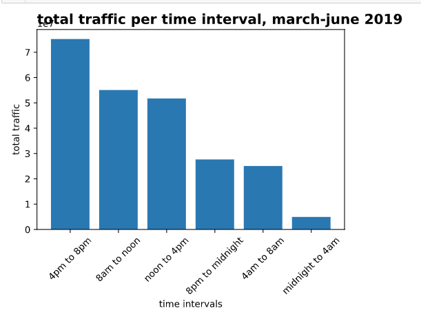
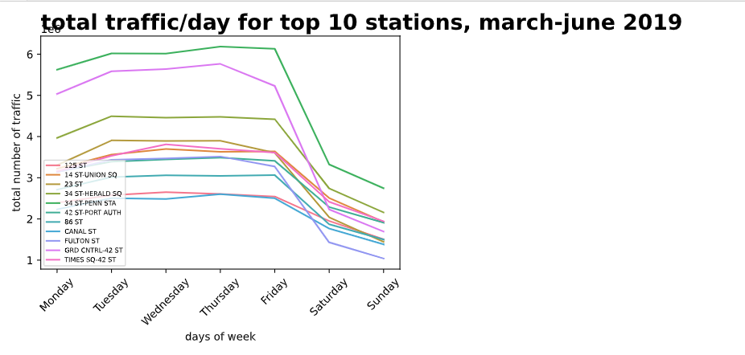

I found the top 10 most trafficked stations for March - June 2019 and am using that data moving forward.

Here I sequestered the total traffic (entry + exit) into 4 hour time intervals to see what the busiest times were for these stations. 

I also plotted the total traffic per day of the week for each station to see if there was a significant drop off in weekday vs weekend. Some stations have a significant weekend drop off while some do not. 

These preliminary results show that perhaps the best times to advertise is during morning and night commuting hours during the week. Things I need to take into account are demographics of the riders for these stations. 